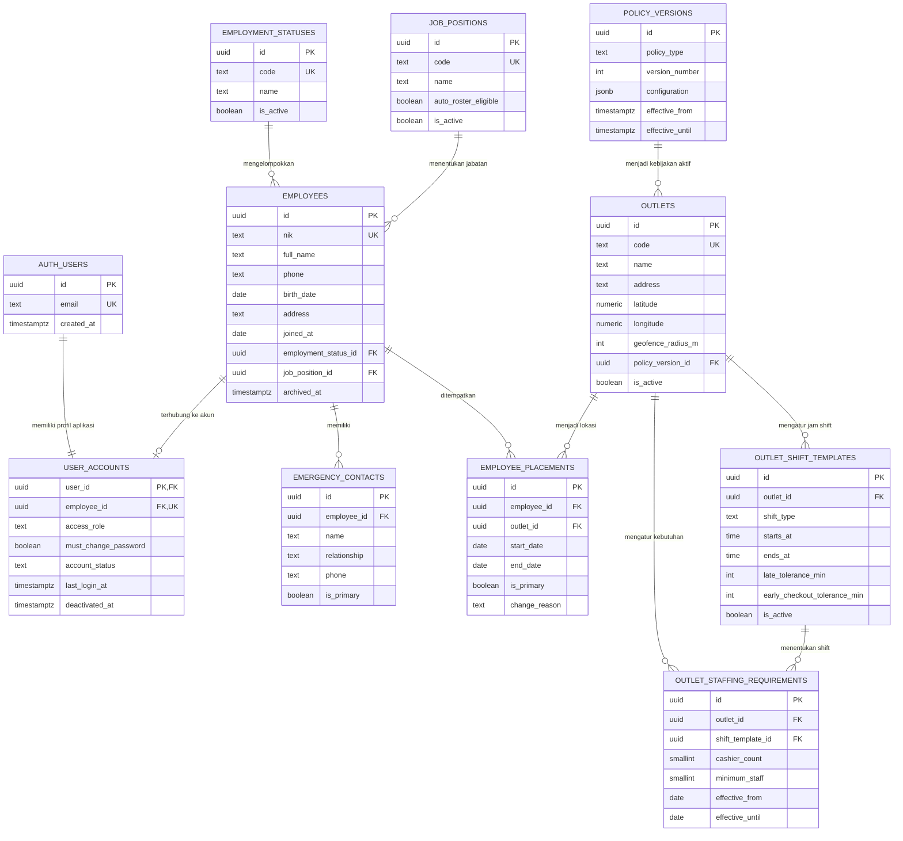
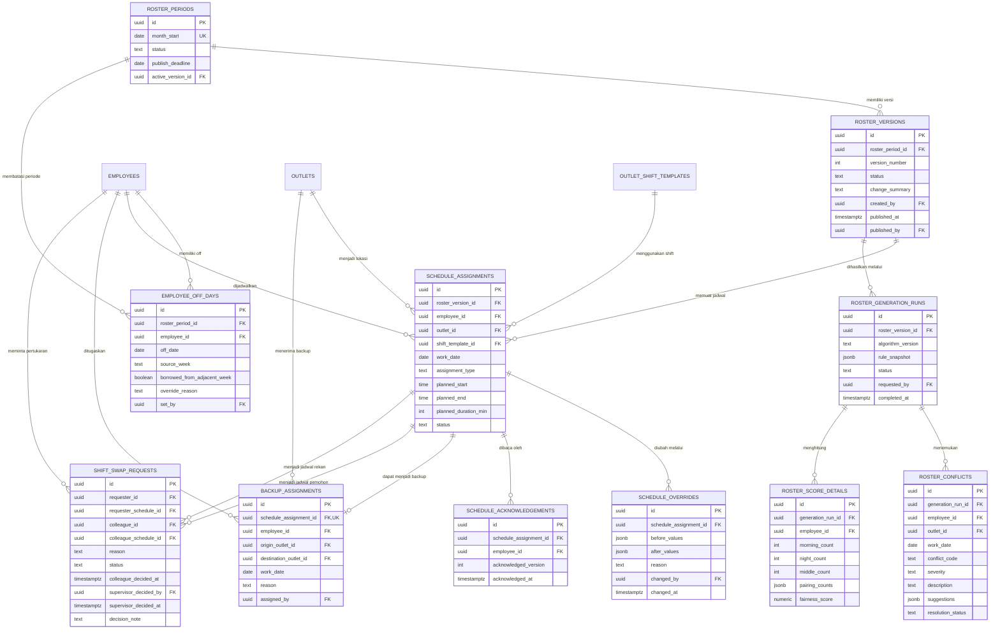
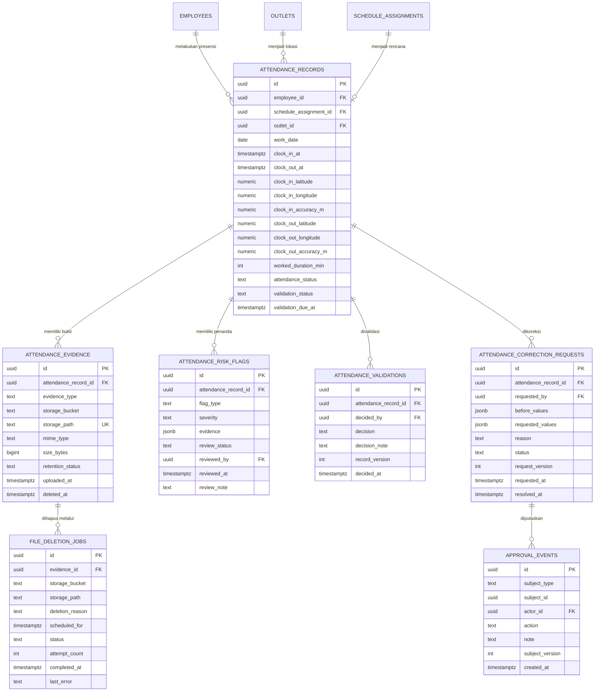

# ERD HR Rajaklana

**Versi:** 1.0

**Status:** Draft untuk review

**Basis data target:** PostgreSQL melalui Supabase

**Dokumen terkait:** [PRD.md](PRD.md)

## 1. Tujuan Dokumen

Dokumen ini mendefinisikan rancangan data untuk aplikasi HR Rajaklana. Rancangan mencakup:

- akun dan hak akses;
- data karyawan, outlet, jabatan, dan riwayat penempatan;
- penyusunan serta publikasi roster;
- presensi berbasis geofence dan selfie;
- cuti, lembur, koreksi presensi, dan alur persetujuan;
- pengumuman, notifikasi, dan tanda sudah dibaca;
- audit, retensi file, impor, dan pencadangan.

ERD ini merupakan rancangan logis. Nama kolom dan tipe data dapat disesuaikan saat migrasi Supabase dibuat, tetapi relasi, batasan bisnis, keamanan, dan kebijakan retensinya harus dipertahankan.

## 2. Konvensi Data

- Primary key menggunakan `uuid`, kecuali tabel referensi yang memang lebih cocok memakai kode pendek.
- Seluruh waktu kejadian disimpan sebagai `timestamptz` dalam UTC dan ditampilkan sebagai WIB pada aplikasi.
- Tanggal kerja menggunakan `date`.
- Durasi disimpan dalam menit agar perhitungan shift dan lembur konsisten.
- Semua tabel transaksi memiliki `created_at` dan `updated_at`.
- Data penting tidak dihapus secara fisik. Gunakan `archived_at`, `deactivated_at`, atau status nonaktif.
- File disimpan pada bucket Supabase Storage privat. Database hanya menyimpan metadata dan path objek.
- Semua perubahan sensitif dicatat di `audit_logs`.
- Nilai status sebaiknya menggunakan PostgreSQL enum atau `check constraint`.

## 3. Gambaran Relasi

```text
Auth & Organisasi
      │
      ├── Roster & Penempatan
      │       └── menentukan jadwal dan lokasi presensi
      │
      ├── Presensi
      │       └── menghasilkan data aktual jam kerja
      │
      ├── Cuti & Lembur
      │       └── memengaruhi ketersediaan dan roster
      │
      └── Komunikasi, Notifikasi & Audit
              └── mencatat perubahan dan konfirmasi pengguna
```

## 4. ERD Identitas, Organisasi, dan Kebijakan



Catatan:

- `AUTH_USERS` merepresentasikan `auth.users` milik Supabase dan tidak dibuat ulang di schema aplikasi.
- `access_role` hanya berisi `employee`, `supervisor`, atau `management`.
- Tiga jenis supervisor merupakan nilai jabatan di `JOB_POSITIONS`; ketiganya mempunyai hak akses aplikasi yang sama melalui `access_role = supervisor`.
- Satu karyawan hanya boleh mempunyai satu penempatan utama yang aktif pada tanggal yang sama.
- Radius geofence dibatasi antara 50 dan 500 meter.
- `POLICY_VERSIONS.configuration` digunakan untuk parameter yang perlu berversi, bukan sebagai pengganti tabel transaksi terstruktur.

## 5. ERD Roster dan Penjadwalan



### Aturan integritas roster

1. Kombinasi `(roster_version_id, employee_id, work_date)` harus unik.
2. Satu versi roster tidak dapat diedit setelah berstatus `published`; perubahan membuat versi baru.
3. Roster hanya boleh dipublikasikan bila tidak ada konflik berstatus `blocking`.
4. Publikasi idealnya dilakukan minimal tujuh hari sebelum awal bulan. Pelanggaran membutuhkan alasan supervisor.
5. Shift `middle` maksimal satu kali per karyawan dalam satu pekan.
6. Jadwal sebelum off diprioritaskan `morning`, sedangkan setelah off diprioritaskan `night`.
7. Pelanggaran pola sebelum/setelah off atau kerja lebih dari enam hari berturut-turut membutuhkan alasan override.
8. Peminjaman off hanya boleh antara dua pekan bersebelahan dalam bulan yang sama.
9. Backup outlet tidak pernah dibuat otomatis. Supervisor memilihnya secara manual dan sistem hanya memvalidasi konflik.
10. Pertukaran shift hanya boleh antara dua jadwal pada outlet yang sama.
11. Perubahan roster setelah publikasi membuat notifikasi dan acknowledgement baru.
12. Validasi aturan lintas baris dijalankan oleh fungsi transaksi database sebelum publikasi.

## 6. ERD Presensi



### Aturan integritas presensi

1. Karyawan hanya dapat memiliki satu sesi presensi terbuka.
2. Kasir hanya dapat clock-in pada outlet penempatan aktif atau outlet backup untuk tanggal tersebut.
3. Supervisor dapat presensi di outlet resmi mana pun dan tidak terikat jam shift, tetapi target jam kerjanya delapan jam.
4. Clock-in kasir paling awal satu jam sebelum jadwal.
5. Clock-in wajib berada dalam radius geofence dan mempunyai selfie dari kamera langsung.
6. Clock-out wajib berada dalam radius geofence, tetapi tidak membutuhkan selfie.
7. Akurasi GPS yang tidak memenuhi ambang batas menghasilkan penolakan sementara dan opsi mencoba ulang.
8. Indikasi mock GPS membuat `ATTENDANCE_RISK_FLAGS`; data tidak langsung ditolak.
9. Presensi harus diputuskan supervisor paling lambat tiga hari setelah clock-out.
10. Supervisor tidak boleh memvalidasi presensinya sendiri.
11. Keputusan pertama yang sah mengunci status. Update harus atomik dengan syarat status masih `pending`.
12. Selfie dari presensi yang disetujui dijadwalkan untuk segera dihapus.
13. Selfie dari presensi yang ditolak disimpan sampai masalah selesai, maksimal 30 hari, dengan peringatan sebelum batas retensi.
14. Penghapusan objek Storage tidak menghapus metadata presensi dan audit.
15. Koreksi yang disetujui memperbarui nilai efektif tetapi tetap menyimpan nilai sebelum dan sesudah.

## 7. ERD Cuti, Lembur, Komunikasi, dan Audit

```mermaid
erDiagram
    LEAVE_TYPES ||--o{ LEAVE_ENTITLEMENTS : "memberikan saldo"
    EMPLOYEES ||--o{ LEAVE_ENTITLEMENTS : "memiliki"
    EMPLOYEES ||--o{ LEAVE_REQUESTS : "mengajukan"
    LEAVE_TYPES ||--o{ LEAVE_REQUESTS : "menentukan jenis"
    LEAVE_REQUESTS ||--o{ REQUEST_ATTACHMENTS : "memiliki lampiran"
    LEAVE_REQUESTS ||--o{ APPROVAL_EVENTS : "diputuskan"
    EMPLOYEES ||--o{ OVERTIME_REQUESTS : "mengajukan atau ditugaskan"
    ATTENDANCE_RECORDS ||--o| OVERTIME_REQUESTS : "menjadi realisasi"
    OVERTIME_REQUESTS ||--o{ APPROVAL_EVENTS : "diputuskan"
    ANNOUNCEMENTS ||--o{ ANNOUNCEMENT_TARGETS : "ditargetkan"
    ANNOUNCEMENTS ||--o{ ANNOUNCEMENT_RECEIPTS : "dibaca"
    EMPLOYEES ||--o{ ANNOUNCEMENT_RECEIPTS : "menerima"
    EMPLOYEES ||--o{ NOTIFICATIONS : "menerima"
    NOTIFICATIONS ||--o| NOTIFICATION_RECEIPTS : "dikonfirmasi"
    USER_ACCOUNTS ||--o{ PUSH_SUBSCRIPTIONS : "mendaftarkan perangkat"
    USER_ACCOUNTS ||--o{ AUDIT_LOGS : "melakukan perubahan"
    USER_ACCOUNTS ||--o{ DATA_IMPORT_JOBS : "menjalankan impor"
    USER_ACCOUNTS ||--o{ BACKUP_EXPORTS : "membuat arsip"

    LEAVE_TYPES {
        uuid id PK
        text code UK
        text name
        boolean deducts_annual_balance
        smallint minimum_notice_days
        boolean same_day_allowed
        boolean requires_document
        smallint document_required_after_days
        boolean is_active
    }

    LEAVE_ENTITLEMENTS {
        uuid id PK
        uuid employee_id FK
        uuid leave_type_id FK
        int year
        numeric granted_days
        numeric used_days
        numeric reserved_days
        numeric expired_days
    }

    LEAVE_REQUESTS {
        uuid id PK
        uuid employee_id FK
        uuid leave_type_id FK
        date starts_on
        date ends_on
        numeric requested_days
        text reason
        text status
        int request_version
        uuid decided_by FK
        timestamptz decided_at
        text decision_note
    }

    REQUEST_ATTACHMENTS {
        uuid id PK
        text subject_type
        uuid subject_id
        text storage_bucket
        text storage_path UK
        text document_type
        text mime_type
        bigint size_bytes
        timestamptz retention_until
        timestamptz deleted_at
    }

    OVERTIME_REQUESTS {
        uuid id PK
        uuid employee_id FK
        text source_type
        uuid attendance_record_id FK
        date overtime_date
        int planned_duration_min
        int actual_duration_min
        int approved_duration_min
        text reason
        text status
        int request_version
        uuid assigned_by FK
        uuid decided_by FK
        timestamptz decided_at
        text decision_note
    }

    ANNOUNCEMENTS {
        uuid id PK
        text title
        text body
        boolean is_pinned
        boolean acknowledgement_required
        timestamptz published_at
        timestamptz expires_at
        uuid created_by FK
    }

    ANNOUNCEMENT_TARGETS {
        uuid id PK
        uuid announcement_id FK
        text target_type
        uuid target_id
    }

    ANNOUNCEMENT_RECEIPTS {
        uuid id PK
        uuid announcement_id FK
        uuid employee_id FK
        timestamptz delivered_at
        timestamptz read_at
        timestamptz acknowledged_at
    }

    NOTIFICATIONS {
        uuid id PK
        uuid employee_id FK
        text notification_type
        text title
        text body
        text subject_type
        uuid subject_id
        jsonb payload
        timestamptz created_at
    }

    NOTIFICATION_RECEIPTS {
        uuid id PK
        uuid notification_id FK,UK
        timestamptz in_app_read_at
        timestamptz push_sent_at
        timestamptz acknowledged_at
    }

    PUSH_SUBSCRIPTIONS {
        uuid id PK
        uuid user_id FK
        text endpoint_hash UK
        text endpoint_encrypted
        text p256dh_encrypted
        text auth_encrypted
        text device_label
        timestamptz last_used_at
        timestamptz revoked_at
    }

    AUDIT_LOGS {
        uuid id PK
        uuid actor_user_id FK
        text action
        text entity_type
        uuid entity_id
        jsonb before_values
        jsonb after_values
        text reason
        inet ip_address
        text user_agent
        timestamptz created_at
    }

    DATA_IMPORT_JOBS {
        uuid id PK
        uuid requested_by FK
        text import_type
        text source_file_path
        text status
        int total_rows
        int success_rows
        int failed_rows
        jsonb validation_errors
        timestamptz completed_at
    }

    BACKUP_EXPORTS {
        uuid id PK
        text export_type
        date period_start
        date period_end
        text storage_path
        text checksum
        uuid requested_by FK
        text status
        timestamptz completed_at
    }
```



### Aturan integritas pengajuan

1. Saldo cuti tahunan awal adalah 12 hari untuk semua karyawan yang memenuhi syarat.
2. Sisa saldo tahunan tidak dibawa ke tahun berikutnya.
3. Cuti tahunan diajukan minimal tiga hari sebelumnya.
4. Cuti sakit dan keadaan darurat boleh diajukan pada hari yang sama.
5. Cuti sakit lebih dari satu hari wajib mempunyai surat dokter.
6. Lampiran cuti disimpan sampai akhir tahun terkait, kemudian dihapus; metadata tetap disimpan.
7. Persetujuan cuti menandai karyawan tidak tersedia dan memicu regenerasi bagian roster yang terdampak.
8. Lembur minimal 60 menit, lalu dibulatkan atau disetujui dalam kelipatan 30 menit.
9. Lembur dapat berasal dari pengajuan karyawan, penugasan supervisor, atau potensi lembur dari clock-out terlambat.
10. Sistem menyimpan durasi rencana, aktual, dan yang disetujui secara terpisah.
11. Supervisor tidak boleh menyetujui pengajuan miliknya sendiri.
12. Keputusan pertama yang sah mengunci pengajuan.
13. Tidak ada kalkulasi nilai pembayaran atau penggajian.

## 8. Kamus Data Ringkas

### 8.1 Identitas dan organisasi

| Tabel | Fungsi | Kolom/kendala penting |
|---|---|---|
| `auth.users` | Identitas autentikasi Supabase | Email unik; password hanya dikelola Supabase Auth |
| `user_accounts` | Profil akses aplikasi | Satu akun per karyawan; wajib ganti password pada login pertama/reset |
| `employees` | Data induk karyawan | NIK unik dengan pola `RK-TAHUN-NNN`; soft delete |
| `employment_statuses` | Status kerja dinamis | Seed: Tetap, Kontrak, Magang |
| `job_positions` | Jabatan dan kelayakan roster otomatis | Kasir ditandai `auto_roster_eligible`; jabatan supervisor tetap menggunakan role yang sama |
| `emergency_contacts` | Kontak darurat karyawan | Maksimal satu kontak utama aktif |
| `outlets` | Data outlet dan titik geofence | Radius 50–500 meter; koordinat wajib untuk outlet aktif |
| `employee_placements` | Riwayat penempatan | Tidak boleh ada dua penempatan utama aktif yang tumpang tindih |
| `outlet_shift_templates` | Jam Morning/Middle/Night per outlet | Unik per `(outlet_id, shift_type)` pada periode aktif |
| `outlet_staffing_requirements` | Kebutuhan minimum staf | Mendukung perubahan efektif berdasarkan tanggal |
| `policy_versions` | Snapshot parameter bisnis | Menjamin keputusan lama dapat diaudit dengan aturan saat itu |

### 8.2 Roster

| Tabel | Fungsi | Kolom/kendala penting |
|---|---|---|
| `roster_periods` | Siklus roster bulanan | Satu periode per bulan |
| `roster_versions` | Versi draft/published/superseded | Nomor versi unik dalam periode |
| `employee_off_days` | Off day yang ditetapkan supervisor | Umumnya satu per pekan; peminjaman off dicatat |
| `schedule_assignments` | Satu jadwal kerja harian | Unik per karyawan, tanggal, dan versi |
| `schedule_overrides` | Alasan perubahan manual | Wajib untuk pengecualian aturan atau perubahan setelah publikasi |
| `schedule_acknowledgements` | Bukti karyawan membaca perubahan | Menyimpan versi yang dibaca |
| `backup_assignments` | Penugasan manual ke outlet lain | Mengaktifkan geofence outlet tujuan hanya pada tanggal penugasan |
| `shift_swap_requests` | Alur pertukaran shift | Rekan menerima lebih dahulu, supervisor memberi keputusan akhir |
| `roster_generation_runs` | Riwayat proses algoritma | Menyimpan versi algoritma dan snapshot aturan |
| `roster_conflicts` | Konflik dan saran penyelesaian | Konflik `blocking` mencegah publikasi |
| `roster_score_details` | Transparansi pemerataan | Menyimpan distribusi Morning/Night/Middle dan pasangan kerja |

### 8.3 Presensi

| Tabel | Fungsi | Kolom/kendala penting |
|---|---|---|
| `attendance_records` | Sesi masuk dan pulang | Satu sesi terbuka per karyawan; terhubung ke jadwal bila ada |
| `attendance_evidence` | Metadata selfie/bukti | Bucket privat; tidak menyimpan URL publik permanen |
| `attendance_risk_flags` | Penanda GPS mencurigakan | Memerlukan review, bukan penolakan otomatis |
| `attendance_validations` | Keputusan supervisor | Keputusan pertama mengunci; tidak boleh self-approval |
| `attendance_correction_requests` | Permintaan koreksi | Wajib menyimpan before/requested/effective values |
| `approval_events` | Timeline keputusan lintas modul | Append-only; bukan sumber status utama |
| `file_deletion_jobs` | Antrean penghapusan Storage | Idempotent, dapat dicoba ulang, dan menyimpan error terakhir |

### 8.4 Cuti dan lembur

| Tabel | Fungsi | Kolom/kendala penting |
|---|---|---|
| `leave_types` | Jenis cuti dinamis | Seed sesuai kebutuhan awal; dapat dinonaktifkan |
| `leave_entitlements` | Saldo cuti per tahun | Unik per karyawan, jenis cuti, dan tahun |
| `leave_requests` | Transaksi pengajuan cuti | Rentang tanggal valid; keputusan pertama mengunci |
| `request_attachments` | Metadata surat dokter/dokumen | Bucket privat; retensi sampai akhir tahun |
| `overtime_requests` | Permintaan/penugasan/realisasi lembur | Durasi rencana, aktual, dan disetujui dipisahkan |

### 8.5 Komunikasi dan operasional

| Tabel | Fungsi | Kolom/kendala penting |
|---|---|---|
| `announcements` | Pengumuman umum atau terarah | Dapat dipasang, kedaluwarsa, dan wajib dibaca |
| `announcement_targets` | Target pengumuman | `all`, `outlet`, atau `employee` |
| `announcement_receipts` | Status kirim/baca/konfirmasi | Unik per pengumuman dan karyawan |
| `notifications` | Notifikasi dalam aplikasi | Menyimpan referensi ke objek penyebab |
| `notification_receipts` | Status in-app dan push | Satu receipt per notifikasi |
| `push_subscriptions` | Perangkat PWA | Endpoint dan key wajib dienkripsi |
| `audit_logs` | Audit perubahan sensitif | Append-only; retensi minimal dua tahun |
| `data_import_jobs` | Impor awal XLSX | Menyimpan validasi dan hasil per baris |
| `backup_exports` | Metadata backup/arsip | Backup mingguan dan arsip bulanan |

## 9. Status yang Direkomendasikan

| Domain | Nilai status |
|---|---|
| Akun | `invited`, `active`, `locked`, `deactivated` |
| Periode roster | `preparing`, `draft`, `published`, `closed` |
| Versi roster | `draft`, `published`, `superseded` |
| Jadwal | `scheduled`, `off`, `cancelled` |
| Pertukaran shift | `pending_colleague`, `pending_supervisor`, `approved`, `rejected`, `cancelled` |
| Presensi | `open`, `completed`, `missing_checkout`, `corrected` |
| Validasi presensi | `pending`, `approved`, `rejected`, `needs_correction` |
| Pengajuan | `draft`, `pending`, `approved`, `rejected`, `cancelled` |
| Risiko | `open`, `cleared`, `confirmed` |
| Pekerjaan penghapusan | `scheduled`, `processing`, `completed`, `failed`, `cancelled` |

## 10. Indeks dan Constraint Penting

Indeks minimum yang direkomendasikan:

```sql
-- Satu penempatan utama aktif per karyawan.
create unique index employee_one_active_primary_placement
on employee_placements (employee_id)
where is_primary = true and end_date is null;

-- Satu jadwal per karyawan per hari dalam setiap versi roster.
create unique index schedule_one_assignment_per_day
on schedule_assignments (roster_version_id, employee_id, work_date);

-- Satu sesi presensi yang belum clock-out.
create unique index attendance_one_open_session
on attendance_records (employee_id)
where clock_out_at is null;

-- Mempercepat antrean validasi.
create index attendance_pending_validation
on attendance_records (validation_due_at)
where validation_status = 'pending';

-- Mempercepat dashboard roster outlet.
create index schedule_outlet_date
on schedule_assignments (outlet_id, work_date);

-- Mempercepat laporan karyawan.
create index attendance_employee_date
on attendance_records (employee_id, work_date desc);

-- Mempercepat pekerja penghapusan file.
create index file_deletion_due
on file_deletion_jobs (scheduled_for)
where status in ('scheduled', 'failed');

-- Audit berdasarkan entitas.
create index audit_entity_timeline
on audit_logs (entity_type, entity_id, created_at desc);
```

Constraint tambahan:

- `outlets.geofence_radius_m between 50 and 500`;
- `clock_out_at >= clock_in_at`;
- `ends_on >= starts_on`;
- durasi lembur yang disetujui adalah `0` atau minimal 60 menit dan kelipatan 30 menit;
- `planned_duration_min > 0`;
- pengguna keputusan harus berbeda dari pemilik subjek untuk proses yang melarang self-approval;
- status final hanya dapat diubah melalui fungsi database terkontrol.

## 11. Transaksi Kritis

### 11.1 Keputusan pertama mengunci

Persetujuan harus dilakukan melalui database function/RPC dalam satu transaksi:

1. ambil baris pengajuan dengan lock;
2. pastikan status masih `pending`;
3. pastikan pemutus bukan pemilik pengajuan;
4. ubah status dan naikkan versi;
5. tulis `APPROVAL_EVENTS` serta `AUDIT_LOGS`;
6. buat notifikasi;
7. commit.

Jika dua supervisor memutuskan bersamaan, hanya transaksi pertama yang memenuhi kondisi status/versi. Transaksi kedua menerima informasi bahwa pengajuan telah diputuskan.

### 11.2 Publikasi roster

Publikasi roster dilakukan secara atomik:

1. validasi seluruh aturan blocking;
2. tandai versi sebelumnya sebagai `superseded`;
3. tandai versi baru sebagai `published`;
4. perbarui `roster_periods.active_version_id`;
5. buat notifikasi dan acknowledgement untuk jadwal baru/berubah;
6. tulis audit.

### 11.3 Validasi presensi dan penghapusan selfie

Setelah presensi disetujui:

1. kunci status validasi;
2. tulis keputusan dan audit;
3. buat `file_deletion_jobs` dengan idempotency key berbasis evidence;
4. worker menghapus objek dari bucket privat;
5. worker mengisi `attendance_evidence.deleted_at`;
6. kegagalan penghapusan dicoba ulang tanpa menggandakan pekerjaan.

## 12. Row Level Security

RLS wajib aktif untuk seluruh tabel pada schema aplikasi.

| Peran | Akses yang diizinkan |
|---|---|
| Karyawan | Membaca profil pribadi, presensi sendiri, saldo dan pengajuan sendiri, notifikasi sendiri; membaca roster seluruh kasir hanya pada kolom yang diizinkan; membuat presensi/pengajuan/koreksi milik sendiri |
| Supervisor | Membaca dan mengelola data operasional; membuat akun; mengatur roster; memberi keputusan, kecuali terhadap data/pengajuan sendiri |
| Management | Membaca dashboard, laporan, roster, dan data operasional yang diperlukan; tidak dapat melakukan mutasi |
| Service role | Worker terjadwal untuk notifikasi, regenerasi roster, retensi file, impor, backup, dan tugas sistem |

Kebijakan tambahan:

- Jangan mengandalkan penyembunyian tombol di UI sebagai kontrol keamanan.
- Kolom sensitif disajikan melalui view/RPC yang sesuai peran.
- Roster yang dapat dilihat karyawan hanya mengekspos nama, outlet, tanggal, shift, jam, off, dan status backup.
- Signed URL selfie hanya dibuat sesaat untuk supervisor yang sedang melakukan validasi.
- `service_role` tidak pernah dikirim ke browser.

## 13. Supabase Storage

Bucket privat yang direkomendasikan:

| Bucket | Isi | Retensi |
|---|---|---|
| `attendance-selfies` | Selfie saat clock-in | Hapus segera setelah disetujui; ditolak maksimal 30 hari |
| `leave-documents` | Surat dokter dan dokumen cuti | Hapus setelah akhir tahun terkait |
| `imports` | File XLSX impor | Hapus setelah proses dan periode troubleshooting selesai |
| `exports` | Arsip laporan/backup | Sesuai kebijakan backup perusahaan |

Path objek sebaiknya tidak memakai nama asli pengguna:

```text
attendance-selfies/{employee_uuid}/{year}/{month}/{evidence_uuid}.jpg
leave-documents/{employee_uuid}/{year}/{attachment_uuid}.{ext}
imports/{job_uuid}/{file_uuid}.xlsx
exports/{year}/{month}/{export_uuid}.{ext}
```

## 14. Retensi dan Privasi

| Data | Retensi |
|---|---|
| Metadata presensi | Disimpan sebagai histori operasional |
| Selfie presensi disetujui | Dihapus segera setelah keputusan |
| Selfie presensi ditolak | Sampai selesai, maksimum 30 hari |
| Lampiran cuti | Sampai akhir tahun terkait |
| Audit log | Minimal dua tahun |
| Riwayat roster dan penempatan | Dipertahankan untuk laporan dan KPI masa depan |
| Password | Hanya dikelola Supabase Auth; tidak disimpan di tabel aplikasi |

Penghapusan file harus menghasilkan audit yang memuat objek, alasan, waktu, dan hasil pekerjaan, tanpa menyimpan kembali isi file.

## 15. View yang Direkomendasikan

| View | Tujuan |
|---|---|
| `v_employee_public_schedule` | Roster semua kasir dengan kolom terbatas untuk pengguna karyawan |
| `v_employee_leave_balance` | Saldo tersedia: granted - used - reserved |
| `v_attendance_daily_summary` | Ringkasan masuk, pulang, terlambat, pulang awal, dan durasi |
| `v_supervisor_validation_queue` | Presensi dan pengajuan pending tanpa milik supervisor yang sedang login |
| `v_roster_fairness_monthly` | Distribusi Morning, Night, Middle, off, dan pasangan kerja |
| `v_outlet_staffing_coverage` | Perbandingan kebutuhan minimum dengan jadwal aktual |
| `v_management_dashboard` | Agregat read-only untuk management |

## 16. Data untuk KPI Fase 2

MVP belum menghitung KPI, tetapi data berikut harus tetap tersedia:

- histori kehadiran dan keterlambatan;
- durasi kerja tervalidasi;
- histori roster beserta seluruh versinya;
- kepatuhan membaca perubahan jadwal;
- shift swap dan backup outlet;
- lembur yang disetujui;
- cuti dan ketidakhadiran;
- konflik roster dan override supervisor;
- audit perubahan data.

KPI masa depan harus ditambahkan sebagai tabel definisi dan hasil penilaian terpisah. KPI tidak boleh mengubah histori sumber.

## 17. Keputusan yang Masih Perlu Dikalibrasi Saat Pilot

Nilai berikut tidak menghambat desain database, tetapi perlu ditetapkan berdasarkan uji coba satu outlet:

- ambang akurasi GPS yang dianggap layak;
- indikator mock GPS yang tersedia pada perangkat target;
- waktu peringatan sebelum selfie ditolak mencapai batas 30 hari;
- bobot skor pemerataan shift dan pasangan kerja;
- kebijakan pembulatan ketika durasi aktual lembur tidak tepat pada kelipatan 30 menit;
- lama retensi file impor dan hasil ekspor;
- definisi pasti karyawan yang berhak menerima saldo cuti tahunan.
